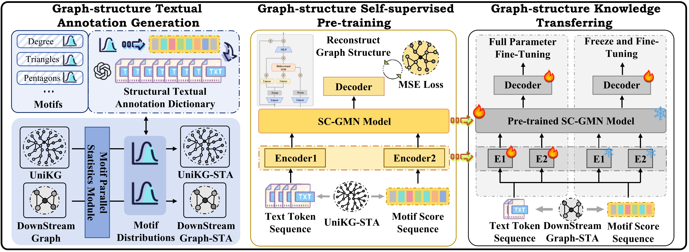
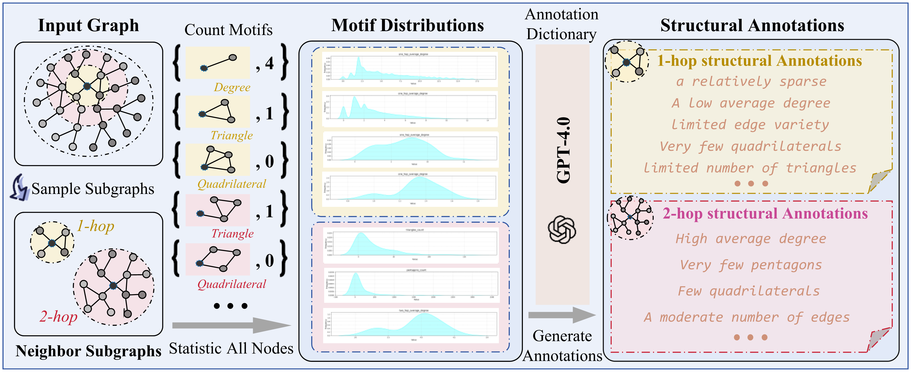
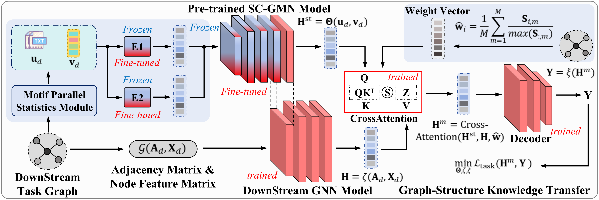

# 🌐 Universal Graph Structural Knowledge Transfer (UGSKT)

[!(https://img.shields.io/badge/PyTorch-1.9.0-%23EE4C2C.svg)]
[!(https://img.shields.io/badge/OGB-1.3.1-%23007CBC.svg)]
[!(https://img.shields.io/badge/License-Apache%202.0-blue.svg)]

Official implementation of ​​"One for All: A Motif-Driven Graph Dual-Serialization Transfer Framework"​​ (Under Review) | |

# 🔥 Key Features

- ​​First universal framework​​ for cross-domain graph knowledge transfer using topological primitives
​​- STA-18 Benchmark​​ - Largest aligned topological-textual graph dataset (18 diverse graphs)
​​- 5.2% avg. performance gain​​ across 13 downstream tasks
​​- Parameter-efficient transfer​​ with <9% additional parameters
​​- Dual-stream ODE Network​​ with theoretical convergence guarantees


# 🚀 Quick Start

## Installation
```
conda create -n ugskt python=3.8
conda activate ugskt
pip install -r requirements.txt
```

## Requirements
```
torch                         1.9.0
numpy                         1.19.2
optuna                        3.5.0
scikit-learn                  1.1.3
scipy                         1.6.2
torch-cluster                 1.6.1
torch-geometric               1.7.2
torch-scatter                 2.0.7
torch-sparse                  0.6.10
torch-spline-conv             1.2.2
ogb                           1.3.1

```

## Datasets:
We have constructed motif scores and generated structured tokens for 14 datasets: 
```
Small-scale Graph Datasets: Pubmed, Citeseer, Cora.
OGB Node-level Datasets: ogbn-products, ogbn-arxiv, ogbn-proteins, ogbn-mag
OGB Edge-level Datasets: ogbl-ppa, ogbl-ddi, ogbl-citation2
OGB Graph-level Datasets: ogbg-ppa, ogbg-molpcba, ogbg-code2
The Largest Heterogeneous Graph Dataset: UniKG
```

## Download Preprocessed Datasets
```
https://pan.quark.cn/s/a68121ffd314
```

# 📊 Benchmark Results

Dataset	Task Type	Base Model	Ours (Frozen)	Ours (Fine-tuned)
ogbn-arxiv	Node Classification	71.3%	​​73.8%​​	​​75.1%​​
ogbl-ppa	Link Prediction	0.776	​​0.891​​	​​0.917​​
ogbg-molpcba	Graph Classif.	0.274 AP	0.281 AP	​​0.289 AP​​
PascalVOC-SP	Node Classif.	0.287 F1	​​0.368 F1​​	​​0.420 F1​


# 🧠 Framework Architecture

## Dual-Serialization Process Pipeline




## Structural Annotation


## Adaptive Transfer Mechanism


# 📚 Citation

```
@article{oneforall2025,
  title={One for All: A Motif-Driven Graph Dual-Serialization Transfer Framework},
  author={Anonymous Authors},
  journal={Under Review},
  year={2025}
}
```

